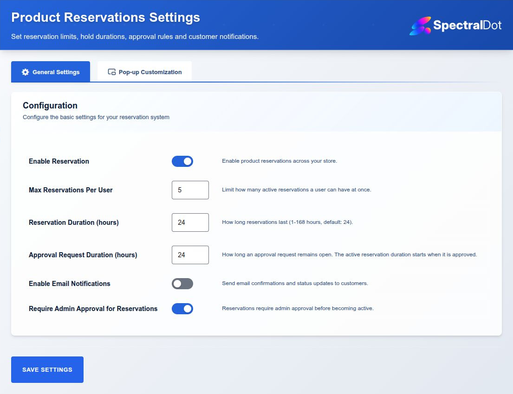
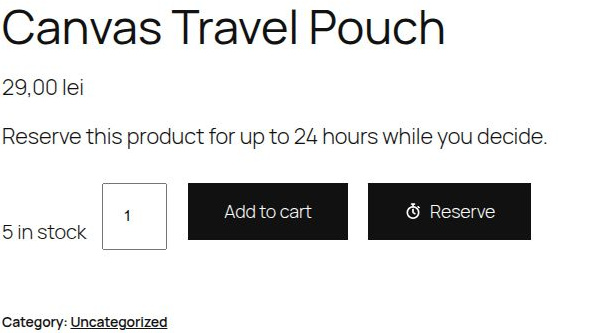
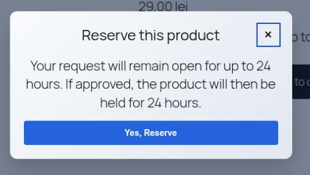
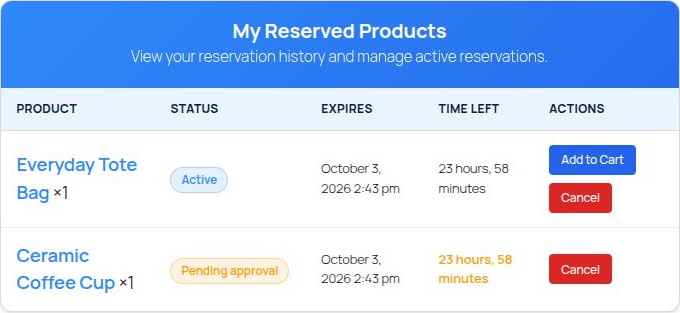
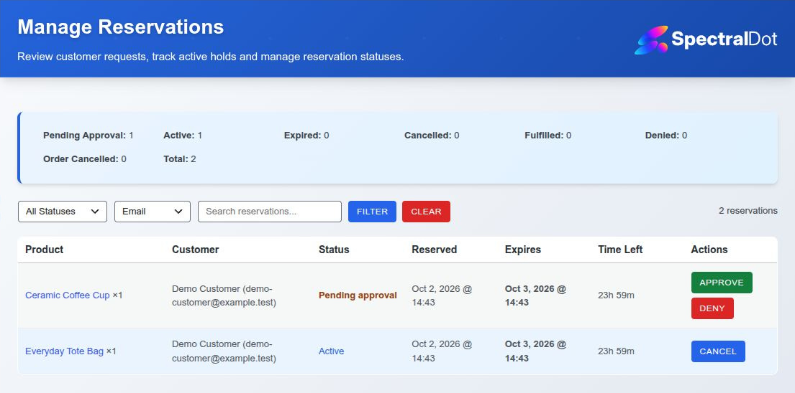
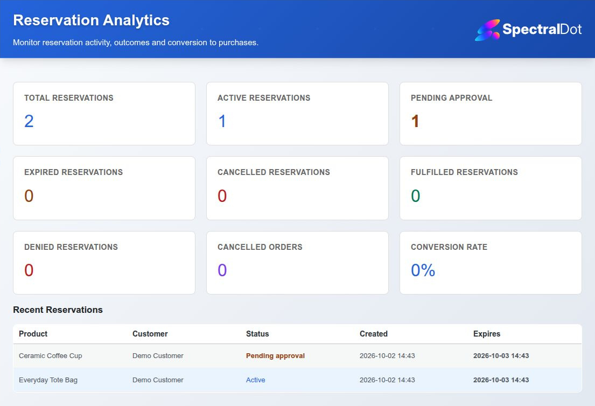

# WordPress.org Directory Assets

This repository folder contains WordPress.org directory artwork and its editable vector masters. It is excluded from the release ZIP. After the plugin is approved and the screenshot refresh is complete, copy the PNG/JPEG assets from this folder to the top-level `/assets` directory of the assigned WordPress.org SVN repository, not to `/trunk/assets`. Do not upload the `source/` directory or this README.

## Supported Assets

Directory artwork is optional for initial code submission. Use these exact names when publishing it:

### Icons
- `icon-128x128.png` - Small icon (128x128px)
- `icon-256x256.png` - Large icon (256x256px)

### Banners
- `banner-772x250.png` - Standard banner (772x250px)
- `banner-1544x500.png` - Retina banner (1544x500px)

### Screenshots

The screenshot captions in `readme.txt` match these sequential files:
- `screenshot-1.jpg` - Plugin settings page
- `screenshot-2.jpg` - Product page with Reserve button and stopwatch icon
- `screenshot-3.jpg` - Reservation confirmation modal
- `screenshot-4.jpg` - My Account reservations page with active and pending records
- `screenshot-5.jpg` - Admin reservations dashboard
- `screenshot-6.jpg` - Basic reservation analytics

### Refresh Status

All six screenshots were recaptured on 2026-10-02 from the installed 1.0.0 release ZIP in an isolated QA database and visually reviewed. They use anonymous demonstration records, the final action palette and current branded views. Captures are framed to actual plugin/product content: no WordPress toolbar, admin sidebar, test-site header, navigation or footer is included. Only rectangular cropping was applied; no interface elements were hidden, recreated or edited into the images. The original test site's records and settings were not modified.

Screenshot 3 shows the actual approval-request confirmation dialog. The heading and close button have a dedicated header row. Successful submissions replace the confirmation question with a result heading and notice; errors keep the confirmation form available. Active and pending success, duplicate errors, modal reset, Tab/Shift+Tab wrapping, Escape closing and opener-focus restoration were checked in the earlier browser verification. Notice/close-control separation was verified at desktop, 390px and 320px widths.

The earlier browser pass verified administrator and Shop Manager actions, customer cancellation, customer isolation and restricted roles. Screenshots 4 and 5 include the corrected customer action spacing and compact admin urgency badge layout. Desktop wrapping and 390px stacked account buttons retain an 8px gap; the pending badge has its own visible border and does not scale the table cell. These checks do not claim full screen-reader or accessibility conformance certification.

All screenshots use their actual JPEG format and `.jpg` extension. The previous modal reference was also JPEG data despite its `.png` filename; its extension was corrected without changing its pixels. WordPress.org supports both `.jpg` and `.png` screenshot names; keep exactly one file per number. See the [official directory asset guidance](https://developer.wordpress.org/plugins/wordpress-org/plugin-assets/#screenshots).

### Current Gallery

#### 1. Settings

#### 2. Product Action

#### 3. Reservation Dialog

Current confirmation state with the corrected button contrast and separate close-control header.

#### 4. Customer Reservations

#### 5. Reservation Management

#### 6. Analytics

## Design Guidelines

The artwork uses the established blue, navy, and amber palette. Icons contain no small text and remain identifiable at 128 pixels. Banners keep essential content in the central safe area. Screenshots show the current Free plugin on a local test site using demonstration records. Recheck all screenshots against the final release candidate before publication.

Editable masters are stored in `source/icon.svg` and `source/banner.svg`. Re-render both required dimensions after changing a master and visually inspect the standard and high-resolution outputs before publication.

## Upload Instructions

When submitting to WordPress.org:
1. Do not include these assets in the plugin ZIP.
2. Upload them to the WordPress.org SVN repository's top-level `/assets` directory.
3. Keep screenshot numbering identical to the captions in `readme.txt`.
4. Confirm image dimensions and file-size limits against the current Plugin Handbook before upload.
5. Set the SVN MIME type to `image/jpeg` for `.jpg` assets and `image/png` for `.png` assets.

## Notes

The local release builder excludes this entire folder through `.distignore`.
